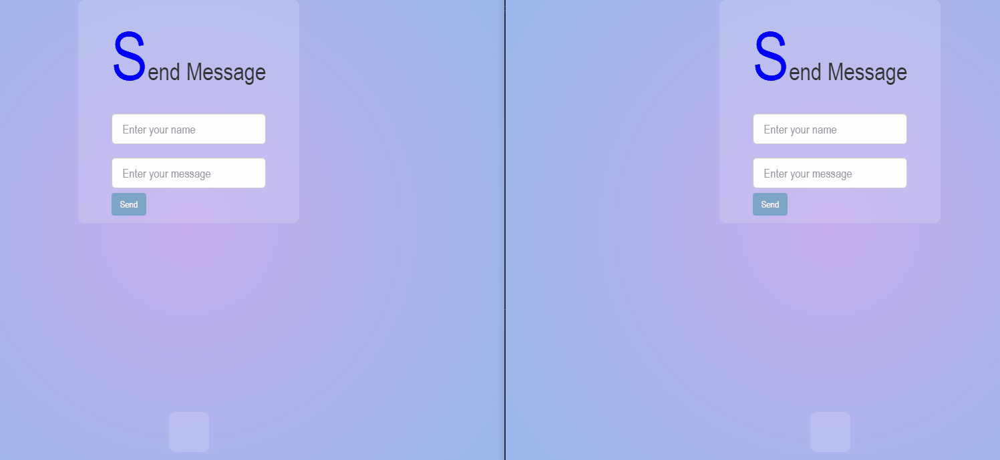

# 📩 Just a simple Chat App 

  - [👉 All things we use](#-all-things-we-use)
  - [👉 Database side](#-database-side)
    - [🖥️ How to set up MongoDB local db](#️-how-to-set-up-mongodb-local-db)
    - [🐛 Error you may have during MongoDB setup](#-error-you-may-have-during-mongodb-setup)


## 👉 All things we use

-   Mongodb
-   Express.js
-   Node.js
-   Socket.io

## 👉 Database side

-   We are gonna keep it simple and make it local since nowhere on Earth is willing to give us free plan of db hosting
-   Mongo Atlas offers just like 1 free database and others such as Clever Cloud

### 🖥️ How to set up MongoDB local db

-   Travel to this [link](https://attacomsian.com/blog/nodejs-mongodb-local-connection) for more
-   Or travel to [this repo](https://github.com/NhutNguyen236/Simple-login-page-with-NodeJS) for more cause I have already put all the notes of how to install and implement db locally here, go check it out 😉

### 🐛 Error you may have during MongoDB setup

`couldn't connect to server 127.0.0.1:27017  - connection could be mute because the target machine actively refused it`

- This happens because your machine has not started MongoDB as a service

- Solution: 

    - 1️⃣ Go and check out your `services.msc` and if `MongoDB` is started or not, if not, start it right the way and done
    - 2️⃣ Begin step 2 if step 1 fails to solve it, you need to Make sure that you added the <MONGODB_PATH>\bin directory to the system variable PATH
    - Open CMD and use this command line as administrator: 
    
    ```bash
        D:\mongodb\bin>mongod --remove
    ```

    - Then do this 
    
    ```bash
        D:\mongodb\bin>mongod --dbpath=D:\mongodb --logpath=D:\mongodb\log.txt --install
    ```

    - Then open `services.msc`

    ```bash
        services.msc
    ```

    - You must see your MongoDB now in your services control panel, start it now

### Build a database to work with
- After all, you need to go to that MongoDB Compass or just using your CMD skill to create a database named "Messages" and a collection named "message" to be compatible with our project

## Client side
- As its name, we are going to keep it simple so the UI is easy to be noticed, nothing much, minimal and cut-off

<p align="center">
    
</p>

- All things you can do is entering names and messages
- Yes, a "Go to top button" too

## Server side
- We use routes to identify the functions, where to get messages and where to send them
- Socket is opend in post route to write messages to database and also to display them to client side

## Modules we used
- Go to [`packages.json`](package.json) for more 😉

